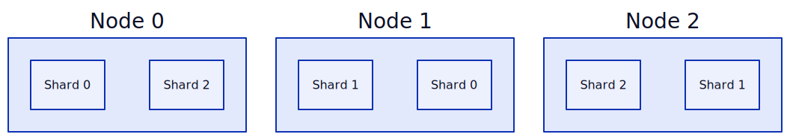

# Distributed Memcached

This project is the result of an investigation into deploying [memcached](https://memcached.org) as a distributed cache to Kubernetes.

## Description
This project consists of Kubernetes manifests for deploying memcached as a distributed cache. 
When using memcached as a distributed system, configuration of the replication & partitioning of cache data is done via the [memcached proxy](https://docs.memcached.org/features/proxy/). 

The manifests that implement the proxy show some possible ways to configure the system that may improve cache availability, hit-rate, or latency.

## Manifests
All proxy configurations assume the cache servers are the ones described in [Cache StatefulSet](#cache-statefulset) deployed in the `cache` namespace.

### Cache StatefulSet
A StatefulSet of memcached servers to be leveraged as a distributed cache.
```bash
kubectl apply -f cache-statefulset.yaml -n cache
```
The headless service allows pods to be referenced individually for consistent hashing.

This setup deploys 3 servers, at most 1 per Kubernetes node, making it suitable for replicating data across nodes. 
However, the pod/node affinity and topology spread constraints should be tuned for the use case.

Memory limits for the memcached server and the pods should be carefully selected.
In this example, each server has up to 256MB of cache, so memory requests and limits are set to 300MiB and 400MiB respectively to allow for slab overhead.

### Proxy DaemonSet
A DaemonSet of memcached proxies to provide a simple, cluster-wide access point for a sharded cache.


```bash
kubectl apply -f proxy-daemonset.yaml -n cache
```
Pods exposed through a loadbalancer service on standard memcached port `11211`.

A ConfigMap configures the proxies to partition keys across StatefulSet pods, assumed to be in the `cache` namespace. 
This effecively pools the memory of all cache servers, meaning clients have a much larger cache available than with standalone cache servers.

### Proxy Sidecar
Implements memcached proxy as a sidecar to an application, to simplify application configuration.


```bash
kubectl apply -f proxy-sidecar.yaml -n cache
```
The app interacts with the proxy as if it were a normal memcached server, on localhost port 11211.

In this example, the proxy is configured to replicate cache entries across each cache server pod, and cache lookups return the fastest available response. 
This means that any cache node going down will not result in lost cache entries, however the cache size available is the same as with standalone servers.

### Cache Sidecar with Cluster Failover
Implements a small, local cache and proxy as sidecars, which fails over to a cluster-wide cache pool.


```bash
kubectl apply -f sidecar-cluster-failover.yaml -n cache
```
The app interacts with the proxy as if it were a normal memcached server, on localhost port 11211.

In this example, the proxy [prioritises a pool using local zones](https://docs.memcached.org/features/proxy/configure/#zones). 
This means that cache reads first query a cache container running in the same pod as the app for lowest latency.
If this misses, the request polls a larger, sharded cache pool. Writes are synchronously written to both local and pooled cache for consistency.

> [!WARNING]
> Only the cluster will be updated with writes from other app clients, so long-living entries in the local cache sidecar may become inconsistent.

The local cache container is configured with 64MB of cache.

## Replicated & Sharded Cache
By replicating *and* sharding data in a distributed cache, data can endure 
server and host machine failure, at the cost of increased memory requirements 
for a given amount of cache entries.



To implement this with Memcached on Kubernetes, cache pods must be placed so
that copies of data are stored on different Kubernetes nodes. Depending on the
number of cache shards & replicas required, and number of Kubernetes nodes 
available, the solution for this may differ slightly.

In this solution, two replicas are deployed using two StatefulSets, which are 
named & labelled by the replica of data that they contain, and pods are evenly
spread across nodes.

```yaml
kind: StatefulSet
metadata:
  name: memcached-0
  labels:
	memcached/replica: 0
spec:
  replicas: 3
  topologySpreadConstraints:
  - maxSkew: 1
    topologyKey: "kubernetes.io/hostname"
    whenUnsatisfiable: DoNotSchedule
    labelSelector:
      matchLabels:
        memcached/replica: 0
```

The pods are then named by their replica and shard name, like so: 
```yaml
# memcached-<REPLICA>-<SHARD>
memcached-0-0, memcached-0-1, memcached-0-2

memcached-1-0, memcached-1-1, memcached-1-2
```

The Memcached Proxy simply lists the pods for each StatefulSet in a dedicated
pool, which are given unique hash seeds, to distribute data differently across 
different pools.

Get requests return the first response, whilst all write/delete operations are
synchronously carried out to both replicas.
```lua
pools{
    set_all = {
        replica_0 = { 
			options = { seed = "replica_0" },
			backends = { 
				"memcached-0-0.memcached-0-headless.cache.svc.cluster.local:11211",
				"memcached-0-1.memcached-0-headless.cache.svc.cluster.local:11211",
				"memcached-0-2.memcached-0-headless.cache.svc.cluster.local:11211",
			} 
		},
        replica_1 = { 
			options = { seed = "replica_1" },
			backends = { 
				"memcached-1-0.memcached-1-headless.cache.svc.cluster.local:11211",
				"memcached-1-1.memcached-1-headless.cache.svc.cluster.local:11211",
				"memcached-1-2.memcached-1-headless.cache.svc.cluster.local:11211",
			}
		},
    },
}

routes{
    cmap = {
        get = route_allfastest{
            children = "set_all",
            miss = false, -- do not failover for a miss, only errors
        },
    default = route_allsync{
        children = "set_all",
    },
}
```

### Pros
- Each replica of data is an independent StatefulSets, so any StatefulSet can 
be restarted/rolled out and all data will remain available via the other 
replica, and over time the synchronous writes will re-populate cache entries.

- Flexible with number of servers in each pool. For example, the second replica
StatefulSet may be setup with a single stand-in node that handles failed
requests, as shown in: [Memcached: Gutter failover for downed backends](https://docs.memcached.org/features/proxy/examples/#gutter-failover-for-downed-backends).

### Cons
- Using unique hash seeds per pool guarantees that distribution of data amongst
cache servers in each pool is different, but it is *not* guaranteed that any
one key will not be replicated on the same Kubernetes node. So, it is *unlikely*
(not impossible) that a node holds both replicas of the same key, meaning
durability of data during node failure is not 100%. However this probability 
reduces as number of Kubernetes nodes increases.

## Help & Resources
* [Configuring memcached proxy](https://docs.memcached.org/features/proxy/configure/)
* [Memcached proxy configuration examples](https://docs.memcached.org/features/proxy/examples/)